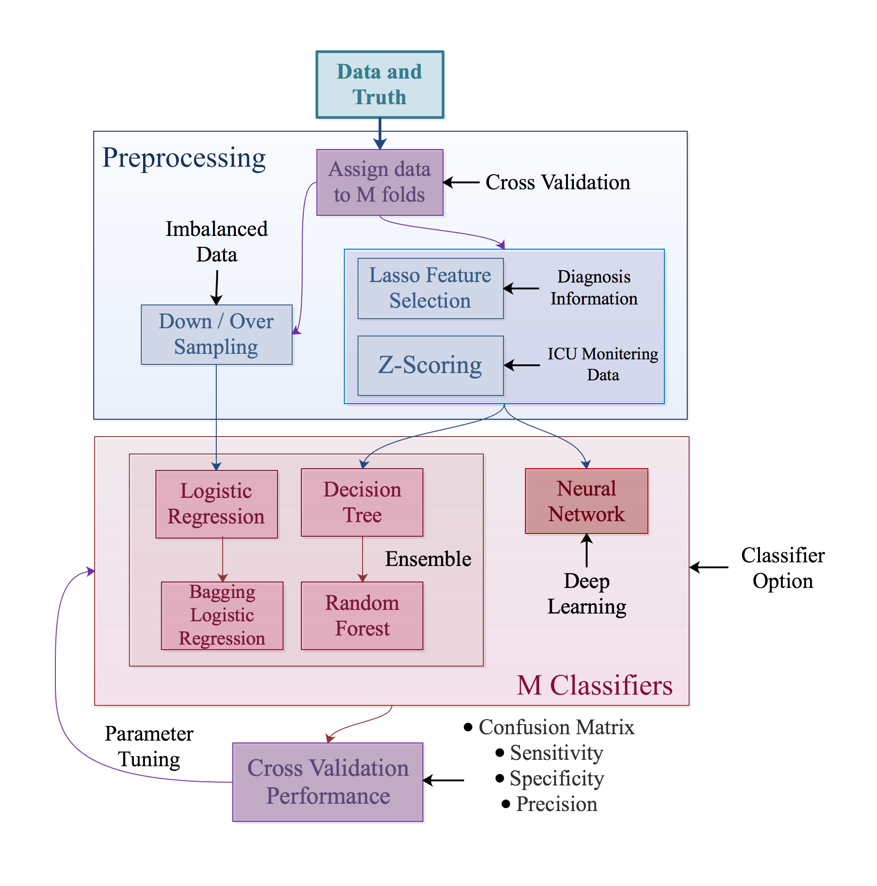

# 30-Day-Readmission-Prediction

> This project aims to predict short-term hospital readmission using [MIMIC-III](https://mimic.physionet.org/) dataset. Utilized features include patients' diagnosis data, vital data and laboratory data collected during ICU stay. Preprocessing techniques include down/over sampling, lasso feature selection, z-scoring. Implemented machine learning algorithms include logistic regression, bagged logistic regression, decision tree and random forest. Deep learning methods include basic full-connected neural networks. Models are evaluated by confusion matrix, accuracy, precision, specificity and sensitivity scores through cross validation.

## Getting Started

### Prerequisites

<ul>
<li>sqlite3 3.30.1</li>
<li>NumPy 1.17.2</li>
<li>pandas 0.25.3</li>
<li>TensorFlow 2.0.0-rc10</li>
<li>Keras 2.2.4</li>
<li>scikit-learn 0.21.3</li>
<li>Matplotlib 3.1.1</li>
<li>seaborn 0.9.0</li>
</ul>

### Setup

1. Download and import [MIMIC-III](https://mimic.physionet.org/) dataset into a sqlite3 .db database file.

2. Clone the repo

```sh
git clone https://github.com/ziyuan-shen/30-Day-Readmission-Prediction.git
```

3. Run notebooks `./Notebooks/*.ipynb` to iterate the project

## Summary Statistics

&nbsp;| Diagnosis Information | ICU Monitoring Data
--- | --- | ---
Tables Used | ICD_DIAGNOSES | CHARTEVENTS</br>LABEVENTS
Readmission</br>Proportion | 5.9% | 6.2%
Data Type | Categorical | Categorical & Numerical
#Dims | 6776 | 57
#Samples | 58925 | 42228


## Pipeline


## Results

### Visualization

* [Data Exploration](https://ziyuan-shen.github.io/files/slides/readmission_data_exploration.pdf)
* [Model Metrics](https://ziyuan-shen.github.io/files/slides/readmission_model_metrics.pdf)

### Notebooks

* Predict readmission using diagnosis features: [View Notebook](https://ziyuan-shen.github.io/files/Readmission_Diagonsis.html)
* Predict readmission using vital and laboratory features: [View Notebook](https://ziyuan-shen.github.io/files/Readmission_ICU.html)

## Docs

Presentation Slides: [Download](https://ziyuan-shen.github.io/files/slides/Readmission_Prediction.pdf)

## Contact

Ziyuan Shen - ziyuan.shen@duke.edu